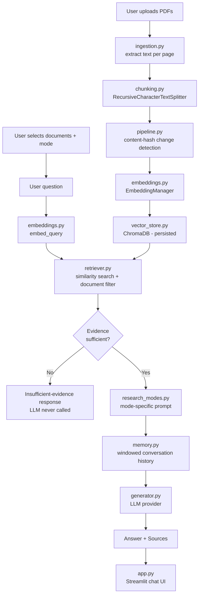

# ResearchMate

**A multi-document AI research assistant powered by Retrieval-Augmented Generation.**

ResearchMate lets you upload multiple PDF research papers, choose which of them participate in retrieval, and ask questions, request summaries, run comparisons, get concept explanations, or search for supporting/contradicting evidence — all grounded in the actual retrieved passages, with page-level citations, never invented.

---

## Features

- 📚 **Multi-PDF knowledge base** — upload and index any number of papers
- ☑️ **Document selection/filtering** — choose exactly which uploaded papers participate in a given query
- 💬 **Conversational Q&A** — follow-up questions ("what are its advantages?") resolve correctly via windowed conversation memory
- 📄 **Source + page-level citations** — every claim traces back to a specific document and page
- 🧭 **Research Modes** — Ask, Summarize, Compare, Explain, Find Evidence
- 🛡️ **Evidence-based responses** — retrieval evidence always outranks the LLM's own pretrained knowledge
- 🚫 **Insufficient-evidence handling** — the system explicitly declines to guess when retrieval comes up weak, instead of hallucinating
- 🔁 **Smart re-indexing** — content-hash based change detection avoids re-embedding unchanged documents, and correctly re-indexes a file if its content changed under the same name
- 🔍 **Debug mode** — inspect retrieved chunks, similarity scores, the active research mode, and the exact prompt sent to the LLM
- 🔌 **Modular LLM backend** — Ollama (local) or OpenAI (API) via one config value
- ♻️ **Persistent vector store** — restart the app without losing your indexed knowledge base

---

## Architecture



## RAG Pipeline

```
PDFs
 ↓
Text extraction              (app/ingestion.py)
 ↓
Chunking                      (app/chunking.py)
 ↓
Content-hash change check     (app/pipeline.py)
 ↓
Embedding generation           (app/embeddings.py)
 ↓
Vector database (ChromaDB)      (app/vector_store.py)
 ↓
Document-filtered retrieval      (app/retriever.py)
 ↓
Evidence-sufficiency gate         (app/generator.py)
 ↓
Mode-specific prompt              (app/research_modes.py)
 ↓
Conversation history window        (app/memory.py)
 ↓
LLM generation                      (app/generator.py)
 ↓
Answer + citations                   (app.py)
```

## Tech Stack

| Layer | Technology |
|---|---|
| UI | Streamlit (`st.chat_message`, `st.chat_input`, checkboxes, radio, metrics) |
| PDF processing | pypdf |
| Text splitting | LangChain `RecursiveCharacterTextSplitter` |
| Embeddings | Sentence Transformers (`all-MiniLM-L6-v2`) |
| Vector database | ChromaDB (persistent, with metadata `where` filtering) |
| LLM | Modular — Ollama (local) or OpenAI (API) |
| Change detection | SHA-256 content hashing |
| Config/secrets | `python-dotenv` |
| Evaluation | Custom script (`evaluation/evaluate.py`) |
| Testing | pytest (42 tests across ingestion, chunking, embeddings, retrieval, generation, prompts, memory, metadata, pipeline) |

## Installation

```bash
git clone <your-repo-url>
cd ResearchMate

python3 -m venv venv
source venv/bin/activate        # Windows: venv\Scripts\activate

pip install -r requirements.txt
cp .env.example .env
```

If using **Ollama** (default, local, free): [install Ollama](https://ollama.com) and pull a model:
```bash
ollama pull llama3.1
```

> **Windows note:** `chromadb` depends on `chroma-hnswlib`, which does not yet publish pre-built wheels for Python 3.13 on Windows. If `pip install` tries to compile it and fails with a Visual C++ error, either install [Microsoft C++ Build Tools](https://visualstudio.microsoft.com/visual-cpp-build-tools/) (check "Desktop development with C++"), or simpler: use a Python 3.11/3.12 virtual environment instead, where pre-built wheels are available.

## Usage

1. **Start the app**: `streamlit run app.py`
2. **Upload papers** in the sidebar (multiple PDFs supported)
3. **Process documents** — extraction, chunking, and embedding happen automatically; unchanged files are skipped on re-runs
4. **Select sources** — check/uncheck which documents participate in retrieval
5. **Pick a Research Mode** — Ask / Summarize / Compare / Explain / Find Evidence
6. **Ask questions** — via the chat input at the bottom
7. **Review citations** — expand "📚 Sources" under any answer to see filename, page, and passage
8. Use **New Chat** / **Clear Conversation** to reset the discussion without losing your indexed documents

### Example Questions

- *Ask:* "What is the difference between RAG-Sequence and RAG-Token?"
- *Summarize:* (select one paper, switch to Summarize mode, submit)
- *Compare:* "Compare the retrieval strategies used in these papers."
- *Explain:* "Explain self-attention to a beginner."
- *Find Evidence:* "Find evidence supporting the claim that retrieval improves factual accuracy."

## Project Structure

```
ResearchMate/
│
├── app/
│   ├── __init__.py
│   ├── ingestion.py        # PDF loading + text extraction
│   ├── chunking.py          # Text splitting with metadata (+ content-hash support)
│   ├── embeddings.py        # EmbeddingManager (sentence-transformers)
│   ├── vector_store.py      # ChromaDB wrapper: persistence, filtering, hashing, registry
│   ├── retriever.py         # Semantic retrieval + document-selection filtering
│   ├── memory.py            # V2: windowed conversation memory
│   ├── research_modes.py    # V2: Ask/Summarize/Compare/Explain/Find Evidence prompts
│   ├── generator.py         # LLM providers + evidence-sufficiency gate + generation
│   ├── prompts.py           # Base RAG prompt assembly (context + history + question)
│   ├── pipeline.py          # Orchestrates ingest→chunk→hash-check→embed→store
│   └── config.py            # Central configuration
│
├── data/
│   ├── documents/           # Uploaded PDFs (git-ignored)
│   └── vector_store/         # Persisted ChromaDB (git-ignored)
│
├── evaluation/
│   ├── questions.json        # Hand-labeled eval set
│   └── evaluate.py            # Retrieval recall + answer correctness evaluation
│
├── tests/
│   ├── test_ingestion.py
│   ├── test_chunking.py
│   ├── test_embeddings.py
│   ├── test_retrieval.py       # incl. document filtering + empty-selection behavior
│   ├── test_generation.py      # incl. insufficient-evidence gating
│   ├── test_prompts.py
│   ├── test_memory.py           # incl. New Chat / Clear Conversation behavior
│   ├── test_metadata.py          # end-to-end metadata preservation
│   └── test_pipeline.py           # content-hash skip/reprocess/duplicate handling
│
├── app.py                    # Streamlit UI
├── requirements.txt
├── .env.example
├── .gitignore
└── README.md
```

## Testing

```bash
pytest tests/ -v
```

All 42 tests are behavioral (they assert on actual outputs, not just "the function exists"), and most use a real, ephemeral ChromaDB collection with a mocked embedding model — so they run fast and offline while still exercising real retrieval/filtering/persistence logic.

## Environment Variables

| Variable | Description | Default |
|---|---|---|
| `LLM_PROVIDER` | `ollama` or `openai` | `ollama` |
| `OLLAMA_MODEL` | Local model name | `llama3.1` |
| `OLLAMA_BASE_URL` | Ollama server URL | `http://localhost:11434` |
| `OPENAI_API_KEY` | Required only if `LLM_PROVIDER=openai` | — |
| `OPENAI_MODEL` | OpenAI model name | `gpt-4o-mini` |
| `CHUNK_SIZE` / `CHUNK_OVERLAP` | Chunking parameters | `500` / `100` |
| `TOP_K` | Chunks retrieved per query | `3` |
| `MEMORY_MAX_TURNS` | Recent conversation turns kept in the prompt | `6` |
| `MIN_EVIDENCE_SIMILARITY` | Minimum best-match similarity (0-1) before answering | `0.2` |
| `DEBUG_MODE` | Show debug panel by default | `false` |

`.env` is git-ignored (verify `.gitignore` includes `.env`, `.venv/`, `__pycache__/`, `*.pyc`) — never commit real secrets.

## Limitations

- No OCR — scanned/image-only PDFs are rejected with a clear error.
- Conversation memory is a fixed-size window (most recent N turns), not summarization — very long conversations will eventually drop earlier context.
- Answer-correctness evaluation uses keyword overlap, a transparent but crude proxy — not an LLM-judge pipeline.
- Document change detection uses whole-file content hashing (not incremental diffing) — any change to the file re-indexes it entirely.
- No authentication or multi-user support — single-user, local-first V2.

## 14. Future Improvements

- OCR pipeline for scanned papers
- Hybrid search (keyword + semantic) for better retrieval on exact terms (e.g. equation names, model numbers)
- Re-ranking retrieved chunks with a cross-encoder before generation
- LLM-based faithfulness scoring in evaluation
- Multi-user support with per-user knowledge bases
- Support for arXiv URLs directly (skip manual PDF download)

## 15. Screenshots


## 16. Author

Built as a portfolio project demonstrating a complete, understandable, production-inspired multi-document RAG assistant — from ingestion through document-filtered retrieval, mode-aware grounded generation, conversational memory, evidence-based citation, and behavioral testing.
