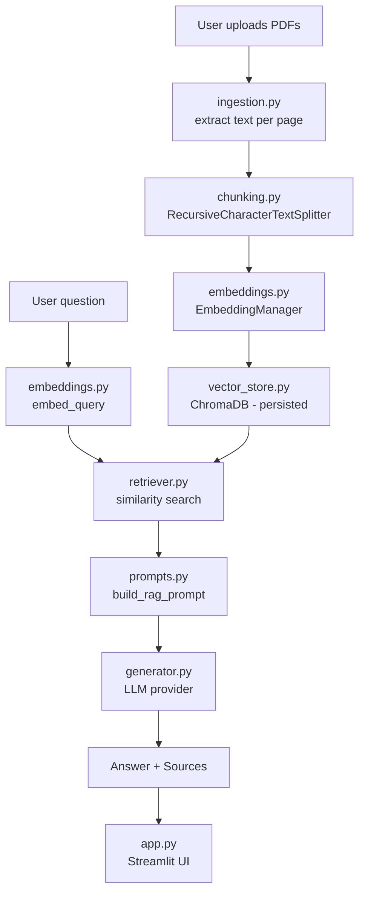

# ResearchMate

**Your AI research assistant for understanding academic papers.**

ResearchMate is a Retrieval-Augmented Generation (RAG) application that lets you upload PDF research papers and ask natural-language questions about them. Answers are generated only from retrieved passages of your own documents, with page-level citations — not from the LLM's general "memory."

---

## 1. Project Overview

Reading through dense academic papers to find a specific answer is slow. ResearchMate indexes your uploaded papers into a searchable vector database, retrieves the most relevant passages for any question you ask, and has an LLM generate a grounded answer — always showing you exactly which document and page each claim came from.

This is a **V1 / classical RAG system**, deliberately scoped to demonstrate a clean, understandable pipeline rather than an agentic or multimodal system. See [Limitations](#13-limitations) for what's intentionally out of scope.

## 2. Problem Statement

Large language models are fluent but prone to hallucination when asked about specific documents they weren't trained on — and even when trained on similar material, they can't tell you *which page* a fact came from. ResearchMate solves this by grounding every answer in retrieved, citable passages from documents the user actually uploaded.

## 3. Features

- 📤 Upload one or more PDF research papers
- ⚙️ One-click processing: extraction → chunking → embedding → indexing
- 💬 Ask natural-language questions across all uploaded papers
- 📚 Every answer includes source citations (filename + page + passage)
- 🔁 Basic multi-turn conversation memory (follow-up questions understand context like "its")
- 🗑️ Clear/reset the knowledge base at any time
- 🔍 Debug mode: inspect retrieved chunks, similarity scores, and the exact prompt sent to the LLM
- 📊 Built-in evaluation harness (retrieval recall, answer correctness)
- 🔌 Modular LLM backend — swap between a local model (Ollama) and an API model (OpenAI) via one config value
- ♻️ Persistent vector store — restart the app without re-indexing unchanged documents

## 4. Architecture Diagram



## 5. RAG Pipeline

```
PDFs
 ↓
Text extraction        (app/ingestion.py)
 ↓
Chunking                (app/chunking.py)
 ↓
Embedding generation    (app/embeddings.py)
 ↓
Vector database          (app/vector_store.py)
 ↓
Semantic retrieval       (app/retriever.py)
 ↓
Relevant chunks
 ↓
Prompt + context          (app/prompts.py)
 ↓
LLM                     (app/generator.py)
 ↓
Answer + citations
```

## 6. Technology Stack

| Layer | Technology |
|---|---|
| UI | Streamlit |
| PDF processing | pypdf |
| Text splitting | LangChain `RecursiveCharacterTextSplitter` |
| Embeddings | Sentence Transformers (`all-MiniLM-L6-v2`) |
| Vector database | ChromaDB (persistent) |
| LLM | Modular — Ollama (local) or OpenAI (API) |
| Config/secrets | `python-dotenv` |
| Evaluation | Custom script (`evaluation/evaluate.py`) |
| Testing | pytest |

## 7. Installation

```bash
git clone <your-repo-url>
cd ResearchMate

python3 -m venv venv
source venv/bin/activate        # Windows: venv\Scripts\activate

pip install -r requirements.txt
```

If using **Ollama** (default, local, free): [install Ollama](https://ollama.com) separately and pull a model:
```bash
ollama pull llama3.1
```

If using **OpenAI** instead, you just need an API key (see below) — no local install needed.

## 8. Environment Variables

Copy the template and fill in your values:

```bash
cp .env.example .env
```

| Variable | Description | Default |
|---|---|---|
| `LLM_PROVIDER` | `ollama` or `openai` | `ollama` |
| `OLLAMA_MODEL` | Local model name | `llama3.1` |
| `OLLAMA_BASE_URL` | Ollama server URL | `http://localhost:11434` |
| `OPENAI_API_KEY` | Required only if `LLM_PROVIDER=openai` | — |
| `OPENAI_MODEL` | OpenAI model name | `gpt-4o-mini` |
| `CHUNK_SIZE` | Characters per chunk | `800` |
| `CHUNK_OVERLAP` | Overlap between chunks | `150` |
| `TOP_K` | Chunks retrieved per query | `5` |
| `DEBUG_MODE` | Show debug panel by default | `false` |

`.env` is git-ignored — never commit real secrets.

## 9. How to Run

```bash
streamlit run app.py
```

Then open the URL Streamlit prints (usually `http://localhost:8501`).

## 10. Example Usage

1. Upload `RAG.pdf`, `DPR.pdf`, `BERT.pdf` in the sidebar.
2. Click **Process Documents** — watch the chunk count update.
3. Ask: *"What is the difference between RAG-Sequence and RAG-Token?"*
4. Read the grounded answer, then expand **Sources** to see the exact passages and page numbers used.
5. Ask a follow-up like *"Which one is used more in the original paper?"* — the assistant understands "one" refers to the prior answer.
6. Toggle **Debug mode** to see the retrieved chunks, similarity scores, and the full prompt sent to the LLM.

## 11. Evaluation Methodology

`evaluation/questions.json` holds a small hand-labeled question set, each with an `expected_answer` and the `source` document it should come from.

Run it (after indexing the corresponding PDFs through the app):

```bash
python -m evaluation.evaluate
```

This reports two metrics, kept deliberately simple and inspectable rather than black-box:

- **Retrieval Recall@K** — for each question, did the retriever return at least one chunk from the expected source document within the top-K results? This isolates retrieval quality from generation quality.
- **Answer correctness rate** — a keyword-overlap check between the generated answer and the expected answer (threshold-based, not an LLM judge, so you can see exactly why a question passed or failed).

Full per-question results are written to `evaluation/results.json` for comparison across runs (e.g. after changing `chunk_size` or `TOP_K`).

## 12. Project Structure

```
ResearchMate/
│
├── app/
│   ├── __init__.py
│   ├── ingestion.py       # PDF loading + text extraction
│   ├── chunking.py         # Text splitting with metadata
│   ├── embeddings.py       # EmbeddingManager (sentence-transformers)
│   ├── vector_store.py     # ChromaDB wrapper (persistent)
│   ├── retriever.py        # Semantic retrieval layer
│   ├── generator.py        # Modular LLM providers + answer generation
│   ├── prompts.py          # System + RAG prompt templates
│   ├── pipeline.py         # Orchestrates ingestion→chunking→embedding→storage
│   └── config.py           # Central configuration
│
├── data/
│   ├── documents/          # Uploaded PDFs (git-ignored)
│   └── vector_store/       # Persisted ChromaDB (git-ignored)
│
├── evaluation/
│   ├── questions.json      # Hand-labeled eval set
│   └── evaluate.py         # Evaluation script
│
├── tests/
│   ├── test_chunking.py
│   ├── test_ingestion.py
│   └── test_prompts.py
│
├── app.py                  # Streamlit UI
├── requirements.txt
├── .env.example
├── .gitignore
└── README.md
```

## 13. Limitations

- No OCR — scanned/image-only PDFs (no text layer) are rejected with a clear error.
- No re-indexing detection beyond filename-derived document ID — editing a PDF but keeping the same filename won't trigger re-processing in V1.
- Conversation memory is simple (raw history passed into the prompt), not summarized or windowed — very long conversations will grow the prompt significantly.
- Answer-correctness evaluation uses keyword overlap, a transparent but crude proxy — not a substitute for human review or an LLM-judge pipeline.
- No authentication, multi-user support, or cloud deployment configuration — this is a local/single-user V1.

## 14. Future Improvements

- OCR pipeline for scanned papers
- Hybrid search (keyword + semantic) for better retrieval on exact terms (e.g. equation names, model numbers)
- Re-ranking retrieved chunks with a cross-encoder before generation
- LLM-based faithfulness scoring in evaluation
- Multi-user support with per-user knowledge bases
- Support for arXiv URLs directly (skip manual PDF download)

## 15. Screenshots

*(placeholder — add screenshots of the sidebar, chat interface, and debug mode here)*

## 16. Author

Built as a portfolio project demonstrating a complete, understandable, production-inspired RAG pipeline — from PDF ingestion through retrieval, generation, citation, and evaluation.
